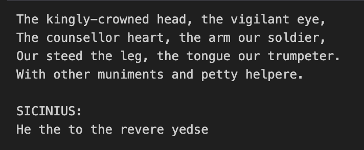

# Shakespeare Transformer — Decoder-Only Transformer from Scratch (just like ChatGPT)

This project implements the [Attention Is All You Need](https://arxiv.org/abs/1706.03762) architecture **from scratch** in PyTorch: no high-level abstractions, no Hugging Face Transformers, just tensors.

I wrote:
- full decoder-only transformer (GPT-style)
- learned token embeddings + sinusoidal positional encodings
- multi-head self-attention with causal masking
- layerNorm, dropout, residual connections, and FFN
- custom training loop with batching + MPS acceleration
- character-level training on Shakespeare's works (no tokenization for simplicity)
- greedy sampling (argmax decoding, going to add support for beam search / top k soon)
- generation that actually *speaks* English (1500s english to be fair)

> Output included structured, Shakespearean dialogue with named characters

**Please check out [`notebook/demo_transformer.ipynb`](https://github.com/akhilvreddy/transformers-reimplementation/blob/main/notebook/demo_transformer.ipynb)** for the end to end model training.

---

## Architecture

- `TokenEmbedding`: `nn.Embedding` × √d_model
- `PositionalEncoding`: fixed sinusoidal
- `MultiHeadAttention`: learnable Q/K/V projection per head
- `Decoder`: stacked decoder blocks with:
  - (MH) Self-attention
  - LayerNorm
  - Feedforward
  - Residuals
- no encoder, no teacher forcing — full auto-regressive decoding.

---

## Training Setup

- **Dataset**: [tiny-shakespeare](https://github.com/karpathy/char-rnn/blob/master/data/tinyshakespeare/input.txt)  
- **Level**: Character  
- **Model size**: d_model=512, 6 layers, 8 heads  
- **Loss**: CrossEntropy  
- **Optim**: Adam (with label smoothing support)  
- **Device**: Apple M4 with MPS acceleration  
- **Epoch time**: ~1 mins  
- **Final loss**: ~0.13
